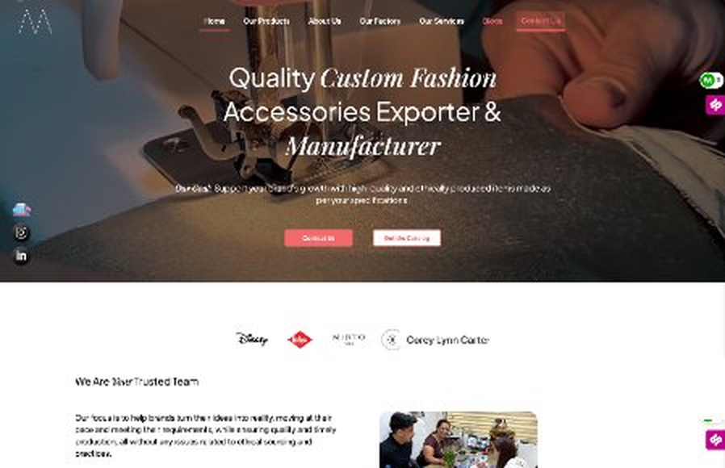
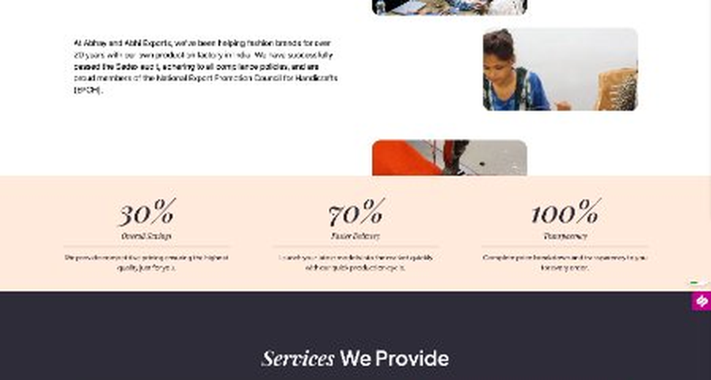
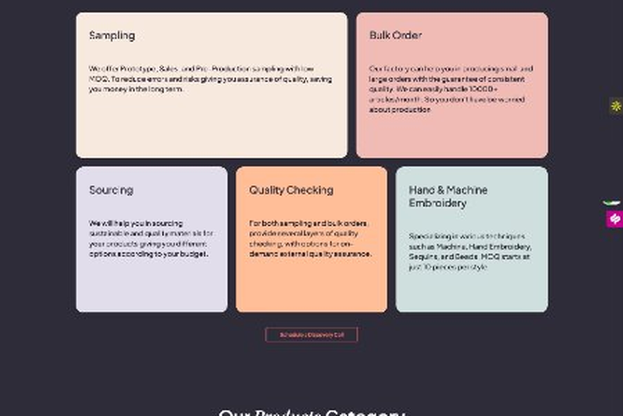
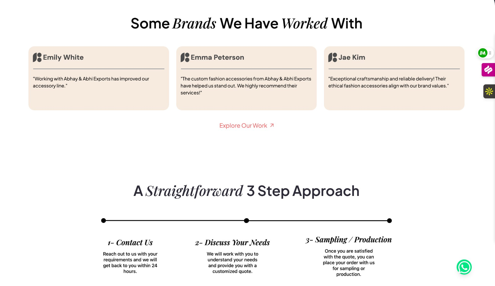
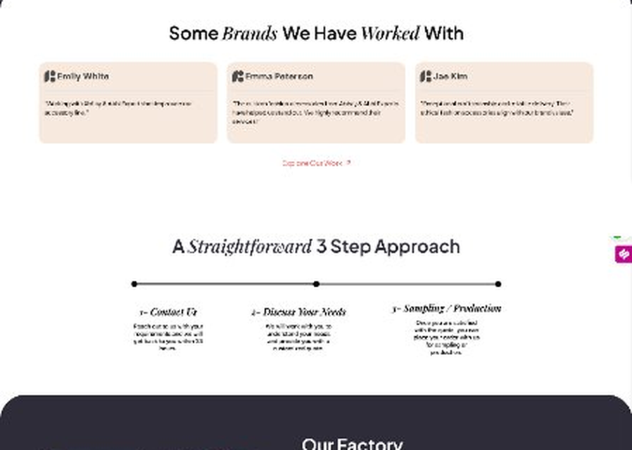
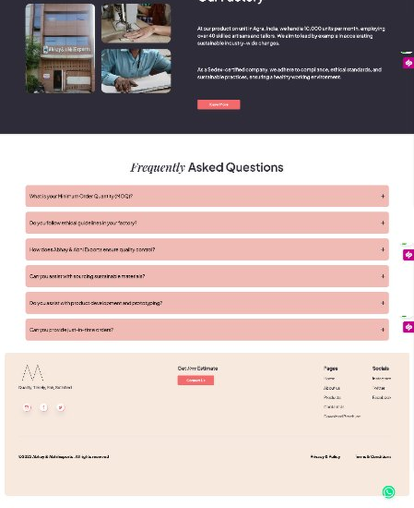

# A&A Exports — Case Study

> Marketing and inbound lead generation website for a 20+ year fashion accessories manufacturer and exporter, supplying brands including Disney, Lee Cooper, Mirto, and Corey Lynn Carter. Built to replace cold outreach with organic inbound from international fashion brands.

**Live:** [abhayandabhiexport.com](https://www.abhayandabhiexport.com)

---

## The Problem

A&A Exports had been operating for 20+ years through purely outbound sales — manual outreach, proposals, and personal contacts. There was no web presence, no inbound channel, and no way for international brands to discover or evaluate the business online.

The goal: build a professional marketing site that communicates credibility, showcases products, and converts visiting brands into leads — replacing cold outreach as the primary acquisition channel.

---

## Screenshots

*Hero section with video background, dual CTAs, and client brand logos — Disney, Lee Cooper, Mirto, Corey Lynn Carter*

*Trusted team section + key performance metrics — 30% savings, 70% faster delivery, 100% transparency*

*Services we provide — Sampling, Bulk Order, Sourcing, Quality Checking, Hand & Machine Embroidery*

*Product category grid — Beaded Bags, Embroidered Apparel, Raffia Bags, Fabric Bags, Printed Dresses, Accessories*

*Client testimonials + 3-step approach — Contact → Discuss → Sample/Produce*

*Factory section (10,000+ units/month, 40+ artisans, Sedex certified) + FAQ accordion + footer*

---

## What Was Built

A full Next.js marketing site with 7 pages, video hero, product catalog, factory credentials, lead capture, and a Firebase-integrated product upload system for internal employees.

### Pages

| Page | Purpose |
|---|---|
| **Home** | Video hero, client brand logos, key metrics, services, product categories, 3-step process, factory, FAQ |
| **Products** | Full catalog — Beaded Bags, Embroidered Apparel, Raffia Bags, Fabric Bags, Printed Dresses, Accessories |
| **About Us** | Company story, 20+ year history, Sedex audit certification, EPCH membership |
| **Our Factory** | 10,000+ units/month, 40+ artisans, Agra India, sustainability and compliance |
| **Our Services** | Sampling, Bulk Orders, Sourcing, Quality Checking, Hand & Machine Embroidery |
| **Blogs** | Content marketing for fashion accessories industry |
| **Contact Us** | Lead capture form + discovery call scheduling |

### Key Features

- **Video hero** — autoplay background video with dual CTAs (Contact Us + Get the Catalog)
- **Brand logo strip** — Disney, Lee Cooper, Mirto, Corey Lynn Carter social proof above the fold
- **Performance metrics** — 30% savings, 70% faster delivery, 100% transparency
- **Product category grid** — 6 categories with photography linking to individual pages
- **3-step process flow** — Contact → Discuss → Sample/Produce, desktop and mobile layouts
- **Factory section** — Sedex audit certification, EPCH membership, sustainability messaging
- **FAQ accordion** — MOQ, ethics, quality control, sourcing, prototyping, JIT orders
- **Downloadable catalog** — PDF brochure available from nav and hero CTA
- **Firebase product upload system** — internal tool allowing employees to upload and manage product catalog entries without touching code (integrated from a previous version of the site)
- **SEO-optimized** — structured metadata, alt text, keyword targeting for fashion accessories search terms
- **Fully responsive** — mobile-first for international buyers on any device

---

## Tech Stack

| Layer | Technology |
|---|---|
| Framework | Next.js (React) |
| Internal Tools | Firebase (product upload system for employees) |
| Deployment | Vercel |
| Media | Next.js Image optimization + HTML5 video |
| Forms | Contact / lead capture |
| SEO | Next.js metadata API, structured alt text |

---

## My Role

Built in collaboration with one other developer ([abhi-rzoro](https://github.com/abhi-rzoro)).

- Next.js architecture and full page implementation across all routes
- Firebase integration for the internal product upload system
- Responsive layouts across all pages and screen sizes
- Next.js Image optimization for all product photography
- Vercel deployment and domain configuration
- SEO optimization — metadata, alt text, structured content

---

## Business Context

A&A Exports is a family manufacturing business I have been involved with since 2018 — first as Leads & Technical Manager (CRM management, business development, client proposals with a 70% win rate), and now as the technical lead building the next phase of the business's digital infrastructure.

This website was the first step in shifting from purely outbound sales to inbound lead generation. The site gives the company's 20+ years of credentials — including clients like Disney, Lee Cooper, Mirto, and Corey Lynn Carter — a public, searchable home that international brands can find and evaluate independently.

**Current active initiative:** Building an AI-powered agent channel on top of this business — automating the client acquisition and qualification pipeline using Next.js + Supabase + LLM/agent tooling, combining 6+ years of domain knowledge in export/manufacturing with full-stack engineering.

---

## Related Projects

- **[PowerCompass Pro](https://github.com/AbhayParasharhere/powercompass-case-study)** — Multi-tenant SaaS CRM (Next.js + Supabase), sole developer, 95% satisfaction
- **[Training Portal — Punjab Insurance](https://github.com/AbhayParasharhere/Training_Portal_PI)** — Full-stack broker training platform (Next.js + Django REST Framework, AWS)
- **[Poster Maker — Punjab Insurance](https://github.com/AbhayParasharhere/Poster-maker-frontend)** — Branded social media poster generation portal (React + Django REST Framework)
